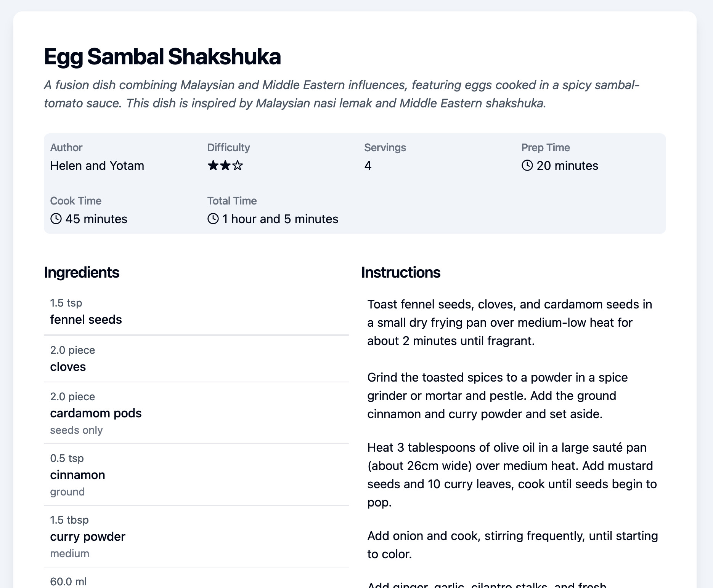

# Recipe Parser

Recipe Parser is a tool that allows you to parse recipes from various sources and convert them into a JSON format. The recipes can be shown in a web application or saved to a database. Example screenshot:



## Quickstart

### Application

Start the server with

```bash
uv run python app.py
```

### Recipe Parser

The recipe parser relies on Claude doing the majority of the work. Ensure that the environment variables are set when running the parser. The parser can be invoked with

```bash
uv run recipe-parser <SOURCE>
```

where SOURCE can be a URL or a path on your local system. The SOURCE can be HTML, a JPEG image or a PDF document. The parser will try to create a recipe in a JSON format and is saved in the `recipes` folder by default. This can be configured in the CLI. For more options, please check it out with

```bash
uv run recipe-parser --help
```
